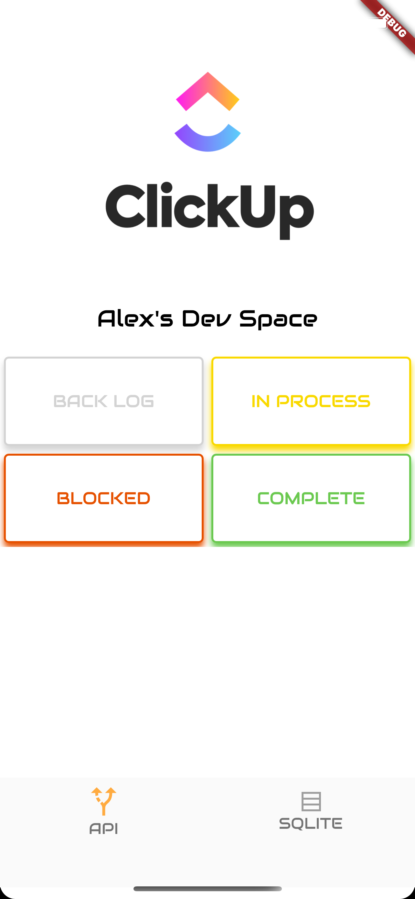
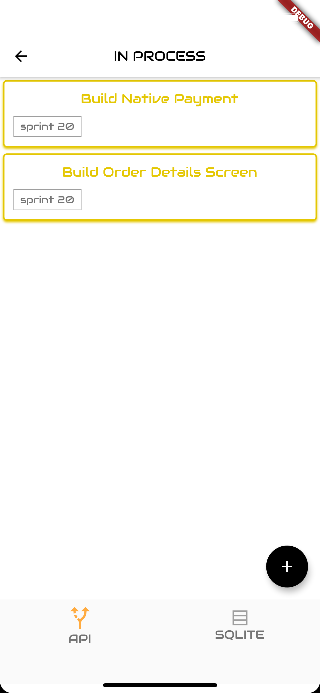
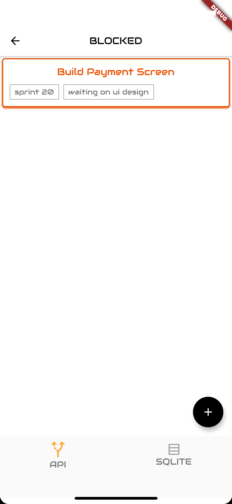
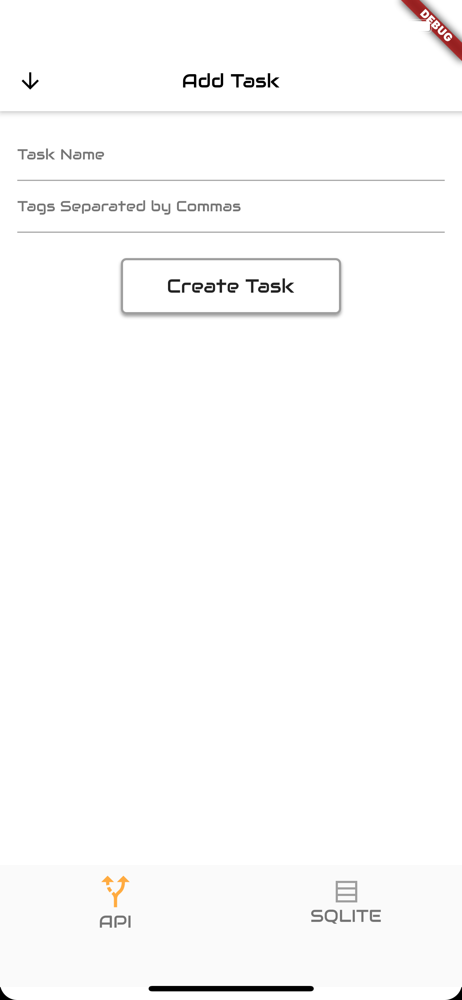

This productivity application has 2 tabs, one using the ClickUp API and another using an SQLite database. 

Set up:
1. Create a ClickUp account.
2. Create a "Space" along with a List of Statuses. 
3. Obtain your API token from your account settings along with your Space ID and List ID.
4. Input your API token, Space ID, and List ID into the "constants.dart" file found within the "common" directory within the project. 

